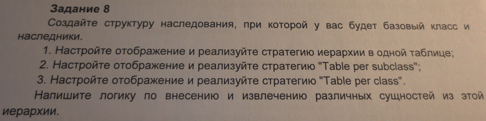

Файл personHierarchy.jar формируется в папке target при помощи Maven.
  Запускается в командной строке командой java -jar personHierarchy.jar

Результат выполнения на экран не выводится, виден только в базе данных.

